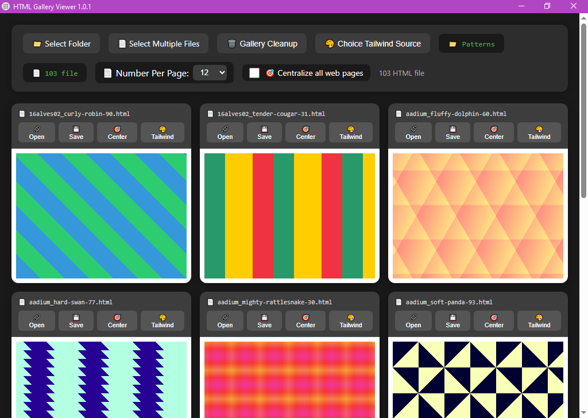
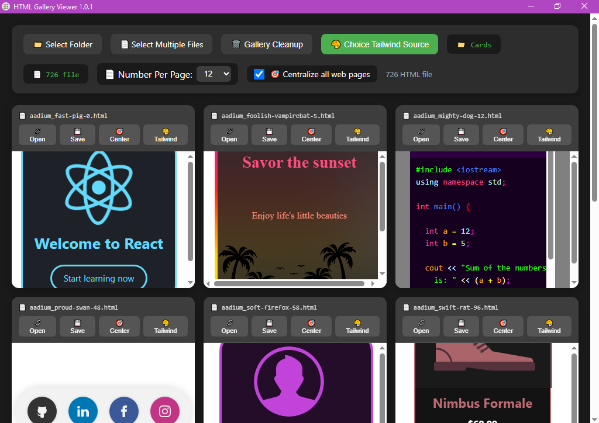
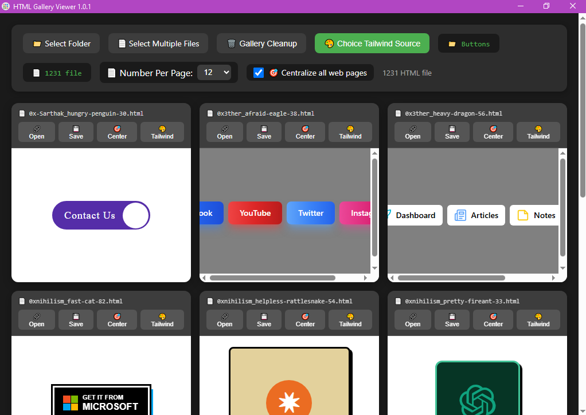
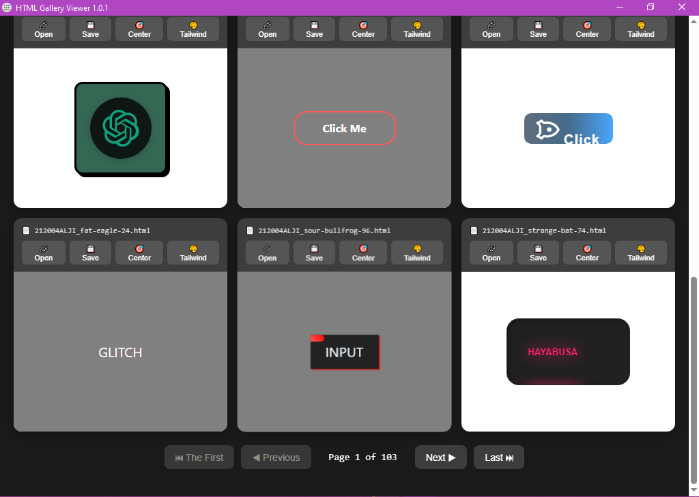
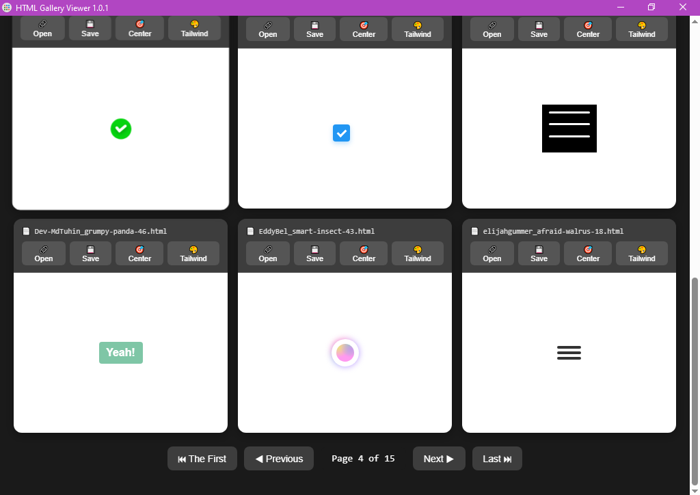
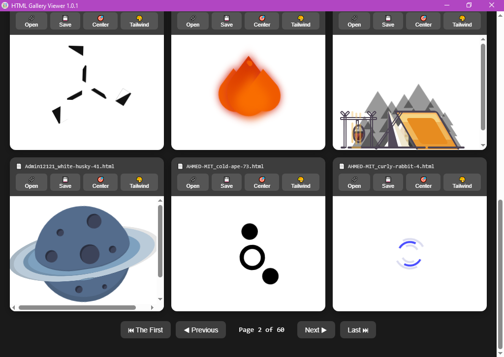

# HTML Gallery Viewer 1.0.1

Preview up to 120 local HTML pages at once — without opening dozens of browser tabs.

HTML Gallery Viewer is a lightweight Windows desktop application for frontend developers, web designers, and developers who work with large collections of local HTML files.

Instead of opening HTML files one by one in your browser, select a folder or multiple HTML files and view them together in a responsive live preview gallery.

The idea came from my own workflow. I often needed to review large collections of HTML templates, prototypes, UI components, and AI-generated HTML pages. Opening hundreds of files manually was slow and inconvenient, so I built this tool to make the process faster.

Workflow:

Select → Preview → Compare → Open

## Features

- 📂 Select an entire folder containing HTML files
- 📄 Select multiple `.html` or `.htm` files
- 🖼️ Preview multiple live HTML pages simultaneously
- 🔢 Display up to 120 previews per gallery page
- ◀️ Navigate large collections using pagination
- 🎯 Center individual previews or all previews
- 🎨 Inject local CSS or JavaScript sources into previews
- 🌐 Support local Tailwind-related files
- 🔗 Open HTML files in browser
- 💾 Save HTML files directly from the gallery
- 🌙 Dark interface designed for long development sessions

## Who is it for?
Important note: This tool is not for everyone. This tool is developed for specific developers and is useful for them. As explained in detail below, this tool will save them a lot of time and hours. It makes their work in development easier and meets their specific needs.

HTML Gallery Viewer is designed for:

- Frontend developers
- Web developers
- Web designers
- UI/UX designers
- HTML template creators
- Developers reviewing prototypes
- Developers working with AI-generated HTML
- Developers comparing multiple UI variations
- Anyone managing large collections of local HTML files
-Anyone who regularly works with large collections of local HTML files Like a set of ready-made tools and plugins like the Galaxy html collections set on GitHub.

## Why?

Working with hundreds or thousands of HTML files can become frustrating when every file needs to be opened separately.

HTML Gallery Viewer creates a visual workspace where you can:

- Compare multiple pages quickly
- Find the right template or prototype faster
- Review generated HTML output efficiently
- Avoid browser tab overload

## Local & Private

HTML Gallery Viewer works locally on your computer.

Your HTML files:

- Stay on your device
- Are not uploaded anywhere
- Do not require an online preview service

## Technical Details

Built with:

- HTML
- CSS
- JavaScript
- Electron

Platform:

- Windows

Application type:

- Desktop application

## Tailwind Support

HTML Gallery Viewer supports selecting a local Tailwind-related `.js` or `.css` file and injecting it into individual HTML previews.

A sample Tailwind JavaScript file is included with the application.

You can use:

- The included Tailwind source
- Your own local CSS/JS source

## Source Code

The source code is not publicly available at the moment.

This repository currently serves as the official information page for HTML Gallery Viewer, including documentation, features, and updates.

I plan to make the source code available here in the future when the project reaches a suitable stage for open-source release.

Until then, the compiled Windows application is available through the official product page:

## Download

The application is available here:

https://www.getly.store/product/html-gallery-viewer-xf2l

##image

Technical Details

-HTML Gallery Viewer is a desktop application built with standard web technologies and packaged with Electron.

-Frontend: HTML, CSS, and JavaScript

-Desktop Runtime: Electron

-Platform: Windows

-Rendering: Local HTML documents are rendered inside the application's gallery using embedded browser frames

-File Handling: Local HTML/HTM files are loaded directly from the user's computer

-Tailwind Support: Local CSS/JavaScript files can be selected and injected into individual HTML previews during the current session

-Internet Connection: Not required for the core HTML preview workflow

-Source Code: Not included. The product is distributed as a compiled desktop application.

Planned Updates
HTML Gallery Viewer will continue to evolve based on user feedback and the reception of the application.

If the product receives enough interest, future updates may expand the current HTML preview capabilities.

Planned Improvements
-Enhanced Single-Page Preview.
-The current Center and Tailwind Source Injection features are available while HTML pages are displayed in the gallery.
-A future update is planned to extend these capabilities to pages opened in a larger, single-page view.
-This would allow you to:
  Center an HTML page while viewing it individually.
  Apply the selected Tailwind CSS/JavaScript source to an individually opened page.
  Work with a single HTML page in a larger viewing area while retaining the same preview controls.

Current Status
At the moment, Center and Tailwind Source Injection are available for HTML pages within the gallery view.
Support for these features in the larger single-page viewing mode is planned for a future update.
Future development will depend on user feedback, and the continued development of HTML Gallery Viewer.
Important
This application is designed for viewing and inspecting local HTML files. It does not replace a full web browser or a complete HTML development environment.
One-time purchase. No subscription.

This repository contains project information only.

The compiled application is distributed separately.

Source code is currently not included.
